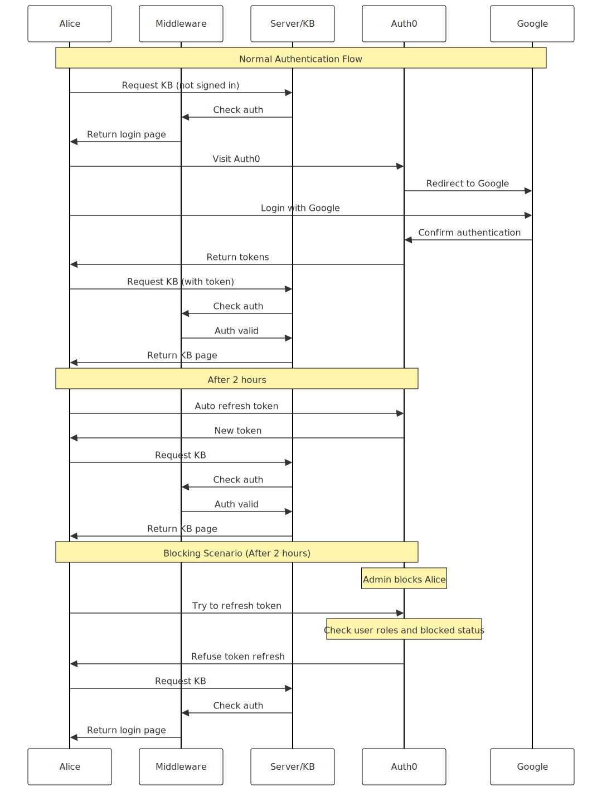

# If I were to build a documentation website... (Arched Door)

If I were to build an internal documentation website. Future- and fool-proof.

**TLDR:**

- Content-first: Markdown, GitHub Flavored Markdown, with raw HTML if we must.

- Web components, if we must, we can use custom elements (AKA web components).

    * Pure Web components, see https://arched-door.netlify.app/the-waste-land

    * Vue-based Web components, see https://vuejs.org/guide/extras/web-components

- Generator- and framework-agnostic: mdBook or VitePress.

- Easy to revoke access: Auth0 hooks, short-lived access tokens with long-lived refresh tokens.

- One source of truth: Notion database, maps employee emails or Discord IDs to their roles or whatever.

    * When an employee leaves the company, an admin updates Notion. \
      This triggers syncing with Auth0 (updating Auth0's database). \
      Auth0 won't provide new access tokens even if the refresh token is still valid.

## Design

See [Sequences](sequences.md):

### Auth

<figure style="background: white;">

</figure>

## Tutorial (WIP)

Netlify:

- Ensure you deactive automatic deployment.

---

END.
